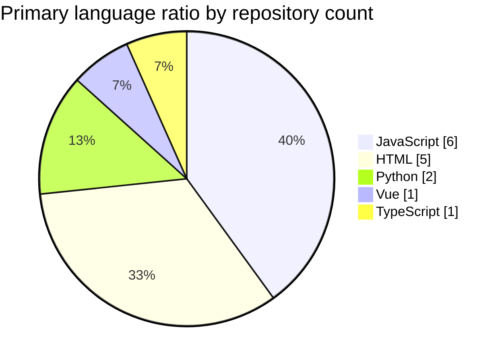

# 냥캣 (`tchinso`) GitHub Profile

> Last refreshed: **2026-03-22 (UTC)**
>
> 목표는 간단합니다. **내가 최근에 손댄 저장소**, **내 저장소에서 많이 보이는 언어**, **많이 쓰인 확장자**를 한눈에 보는 프로필 README입니다.

## Recent repositories

최근 공개 저장소 페이지의 `Updated` 기준으로 가장 위에 보이는 5개 저장소입니다.

1. [tchinso](https://github.com/tchinso/tchinso) — Updated **2026-03-22**
2. [MekiCopy](https://github.com/tchinso/MekiCopy) — Updated **2026-03-22**
3. [Favorites](https://github.com/tchinso/Favorites) — Updated **2026-03-21**
4. [MyFilter](https://github.com/tchinso/MyFilter) — Updated **2026-03-20**
5. [2026NovPlan](https://github.com/tchinso/2026NovPlan) — Updated **2026-03-19**

## Language ratio across my repositories

> 기준: 공개 저장소 목록에서 확인 가능한 **대표 언어(primary language)** 를 저장소 수 기준으로 집계.
> 
> `tchinso`, `2026NovPlan`처럼 GitHub가 대표 언어를 표시하지 않은 저장소는 아래 비율 계산에서 제외했습니다.

| Language | Repos | Ratio |
| --- | ---: | ---: |
| JavaScript | 6 | 40.0% |
| HTML | 5 | 33.3% |
| Python | 2 | 13.3% |
| Vue | 1 | 6.7% |
| TypeScript | 1 | 6.7% |

## Extension ranking

> 기준: 위 언어 집계를 확장자 관점으로 정리한 **프로필용 요약 랭킹**.
> 
> 즉, 저장소의 대표 언어를 대표 확장자로 대응해 빠르게 보는 용도입니다.

| Rank | Extension | Based on | Count |
| --- | --- | --- | ---: |
| 1 | `.js` | JavaScript repos | 6 |
| 2 | `.html` | HTML repos | 5 |
| 3 | `.py` | Python repos | 2 |
| 4 | `.vue` | Vue repos | 1 |
| 5 | `.ts` | TypeScript repos | 1 |

## Live cards

실시간 카드가 필요하면 아래 이미지를 그대로 유지해서 프로필에 붙여둘 수 있습니다.

## Notes

- 최근 저장소 목록은 GitHub 공개 저장소 페이지의 최신 `Updated` 순서를 따랐습니다.
- 언어 비율은 **코드 바이트 수 기준이 아니라 저장소 대표 언어 기준** 입니다.
- 확장자 랭킹은 프로필 README에서 보기 좋게 정리한 **요약용 추정치** 입니다.
