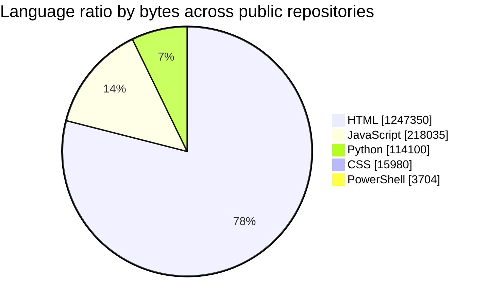
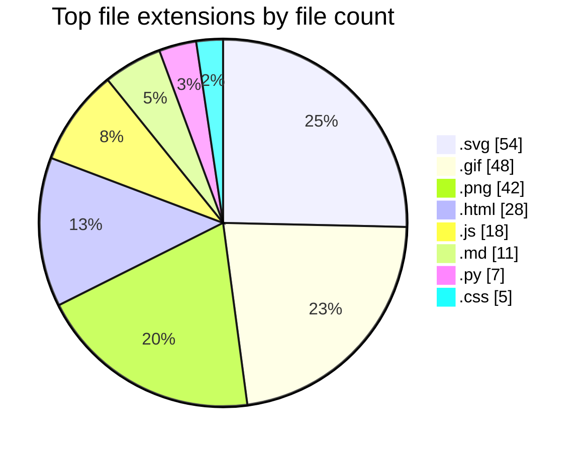

# 냥캣 (`tchinso`) GitHub Profile

> Last refreshed automatically: **2026-04-09 03:27 UTC**

## Recent repositories

<table width="100%">
<tr><td align="center"></td></tr>
<tr><td align="center"></td></tr>
<tr><td align="center"></td></tr>
<tr><td align="center"></td></tr>
<tr><td align="center"></td></tr>
<tr><td align="center"></td></tr>
<tr><td align="center"></td></tr>
<tr><td align="center"></td></tr>
<tr><td align="center"></td></tr>
</table>

## Language ratio across my repositories

> 기준: 내 공개 저장소 전체의 GitHub `languages` API 값을 합산한 **바이트 수 기준** 집계입니다.

언어 비율 표 보기 (접힘)

| Language | Bytes | Ratio |
| --- | ---: | ---: |
| HTML | 1,247,350 | 78.0% |
| JavaScript | 218,035 | 13.6% |
| Python | 114,100 | 7.1% |
| CSS | 15,980 | 1.0% |
| PowerShell | 3,704 | 0.2% |

## Extension ranking

> 기준: 내 공개 저장소의 기본 브랜치를 재귀적으로 스캔해 파일 확장자 개수를 집계했습니다.

확장자 랭킹 표 보기 (접힘)

| Rank | Extension | Files |
| --- | --- | ---: |
| 1 | `.svg` | 54 |
| 2 | `.gif` | 48 |
| 3 | `.png` | 42 |
| 4 | `.html` | 28 |
| 5 | `.js` | 18 |
| 6 | `.md` | 11 |
| 7 | `.py` | 7 |
| 8 | `.css` | 5 |
| 9 | `.pyc` | 5 |
| 10 | `.json` | 5 |
| 11 | `.onnx` | 3 |
| 12 | `.spec` | 2 |
| 13 | `.ps1` | 2 |
| 14 | `.txt` | 2 |
| 15 | `.db` | 2 |
| 16 | `.bat` | 2 |
| 17 | `.yml` | 1 |
| 18 | `.gitignore` | 1 |
| 19 | `.gitkeep` | 1 |
| 20 | `.ico` | 1 |

## Live cards

> 기존 `github-readme-stats.vercel.app` 공개 엔드포인트는 트래픽/레이트리밋 영향으로 카드가 간헐적으로 비어 보일 수 있어,  
> 동일한 데이터 소스를 쓰는 `github-profile-summary-cards.vercel.app` 카드로 교체했습니다.

