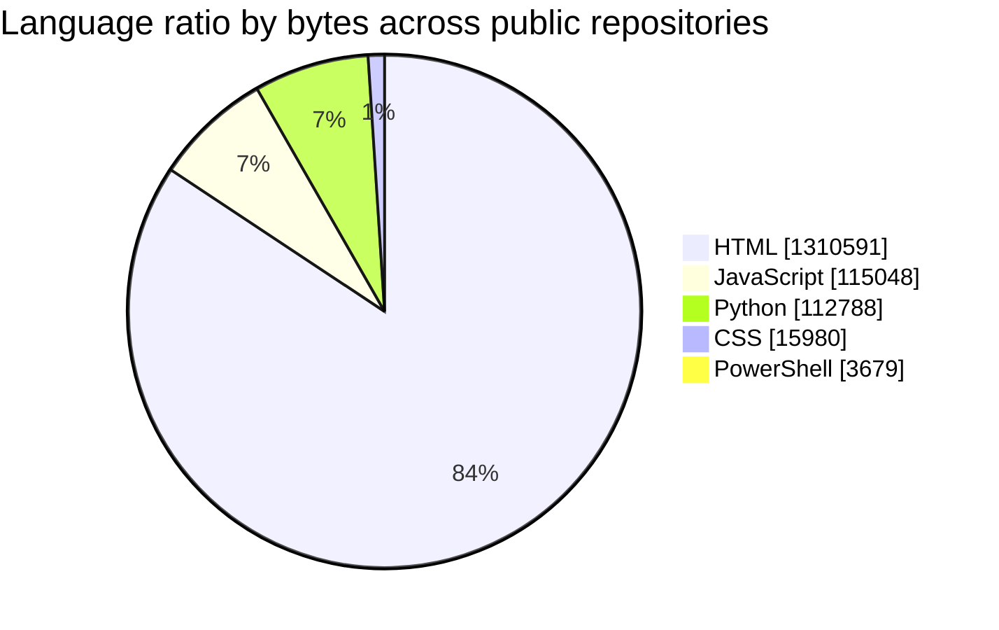

# 냥캣 (`tchinso`) GitHub Profile

> Last refreshed automatically: **2026-04-05 03:36 UTC**
>
> 이 README는 GitHub API 기반으로 자동 생성됩니다. 하드코딩 대신 **최근 저장소 / 언어 비율 / 확장자 랭킹**을 주기적으로 다시 계산합니다.

## Recent repositories

최근 `pushed_at` 기준으로 가장 최근에 수정되거나 반영된 공개 저장소 10개입니다.

1. [Favorites](https://github.com/tchinso/Favorites) — Updated **2026-04-05**
2. [card-assets](https://github.com/tchinso/card-assets) — Updated **2026-04-04**
3. [PersonalWiki](https://github.com/tchinso/PersonalWiki) — Updated **2026-04-04**
4. [tchinso](https://github.com/tchinso/tchinso) — Updated **2026-04-04**
5. [fav](https://github.com/tchinso/fav) — Updated **2026-04-03**
6. [MyFilter](https://github.com/tchinso/MyFilter) — Updated **2026-03-28**
7. [ScreenDimmer](https://github.com/tchinso/ScreenDimmer) — Updated **2026-03-22**
8. [MekiCopy](https://github.com/tchinso/MekiCopy) — Updated **2026-03-22**
9. [FrontlineSkirmish](https://github.com/tchinso/FrontlineSkirmish) — Updated **2025-09-27**
10. [Subtitle_Overlayer](https://github.com/tchinso/Subtitle_Overlayer) — Updated **2025-09-14**

## Language ratio across my repositories

> 기준: 내 공개 저장소 전체의 GitHub `languages` API 값을 합산한 **바이트 수 기준** 집계입니다.

| Language | Bytes | Ratio |
| --- | ---: | ---: |
| HTML | 1,310,591 | 84.1% |
| JavaScript | 115,048 | 7.4% |
| Python | 112,788 | 7.2% |
| CSS | 15,980 | 1.0% |
| PowerShell | 3,679 | 0.2% |

## Extension ranking

> 기준: 내 공개 저장소의 기본 브랜치를 재귀적으로 스캔해 파일 확장자 개수를 집계했습니다.

| Rank | Extension | Files |
| --- | --- | ---: |
| 1 | `.svg` | 54 |
| 2 | `.gif` | 48 |
| 3 | `.png` | 42 |
| 4 | `.html` | 31 |
| 5 | `.js` | 13 |
| 6 | `.md` | 11 |
| 7 | `.py` | 7 |
| 8 | `.css` | 5 |
| 9 | `.pyc` | 5 |
| 10 | `.json` | 5 |
| 11 | `.onnx` | 3 |
| 12 | `.spec` | 2 |
| 13 | `.ps1` | 2 |
| 14 | `.txt` | 2 |
| 15 | `.db` | 2 |
| 16 | `.bat` | 2 |
| 17 | `.ico` | 1 |
| 18 | `.webp` | 1 |
| 19 | `.yml` | 1 |
| 20 | `.gitignore` | 1 |

## Live cards

## Notes

- 프로필 README 단독 Markdown만으로는 GitHub 내부 데이터를 실시간 계산할 수 없어서, **GitHub Actions가 주기적으로 README를 재생성**하도록 구성했습니다.
- 최근 저장소는 `pushed_at`, 언어 비율은 `languages` API, 확장자 랭킹은 기본 브랜치의 Git tree 재귀 조회 결과를 사용합니다.
- 이 저장소가 `tchinso/tchinso` 프로필 저장소라면, Actions가 실행될 때마다 프로필 화면도 함께 최신 상태로 유지됩니다.
