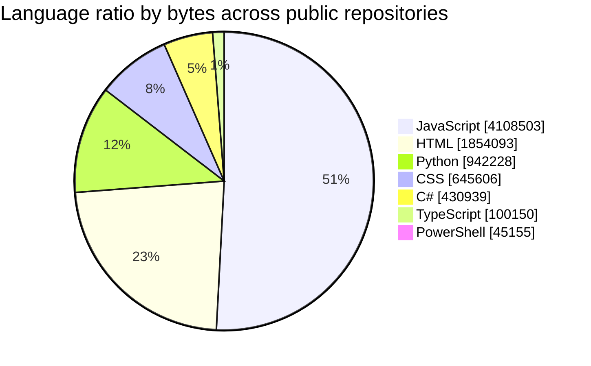
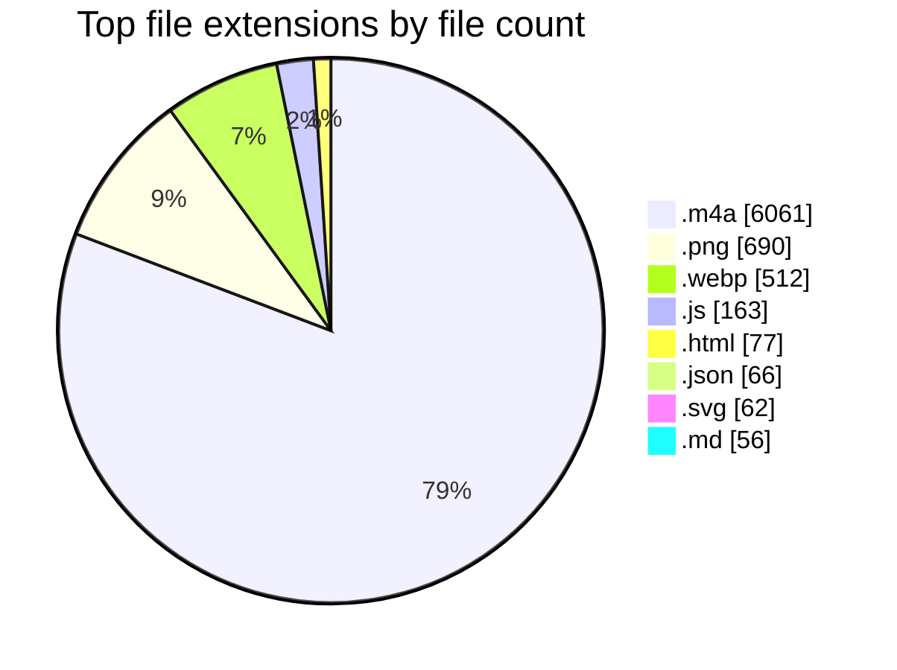

## Recent repositories

<table width="100%">
<tr><td align="center"></td></tr>
<tr><td align="center"></td></tr>
<tr><td align="center"></td></tr>
<tr><td align="center"></td></tr>
<tr><td align="center"></td></tr>
<tr><td align="center"></td></tr>
<tr><td align="center"></td></tr>
<tr><td align="center"></td></tr>
<tr><td align="center"></td></tr>
<tr><td align="center"></td></tr>
<tr><td align="center"></td></tr>
<tr><td align="center"></td></tr>
</table>

# 냥캣 (`tchinso`) GitHub Profile

> Last refreshed automatically: **2026-09-03 22:33 UTC**

## Language ratio across my repositories

```mermaid
pie showData
    title Language ratio by bytes across public repositories
    "JavaScript" : 4108503
    "HTML" : 1854093
    "Python" : 942228
    "CSS" : 645606
    "C#" : 430939
    "TypeScript" : 100150
    "PowerShell" : 45155
```

언어 비율 표 보기 (접힘)

| Language | Bytes | Ratio |
| --- | ---: | ---: |
| JavaScript | 4,108,503 | 50.2% |
| HTML | 1,854,093 | 22.6% |
| Python | 942,228 | 11.5% |
| CSS | 645,606 | 7.9% |
| C# | 430,939 | 5.3% |
| TypeScript | 100,150 | 1.2% |
| PowerShell | 45,155 | 0.6% |

## Extension ranking

```mermaid
pie showData
    title Top file extensions by file count
    ".m4a" : 6061
    ".png" : 690
    ".webp" : 512
    ".js" : 163
    ".html" : 77
    ".json" : 66
    ".svg" : 62
    ".md" : 56
```

확장자 랭킹 표 보기 (접힘)

| Rank | Extension | Files |
| --- | --- | ---: |
| 1 | `.m4a` | 6,061 |
| 2 | `.png` | 690 |
| 3 | `.webp` | 512 |
| 4 | `.js` | 163 |
| 5 | `.html` | 77 |
| 6 | `.json` | 66 |
| 7 | `.svg` | 62 |
| 8 | `.md` | 56 |
| 9 | `.py` | 52 |
| 10 | `.gif` | 48 |
| 11 | `.sql` | 41 |
| 12 | `.glb` | 31 |
| 13 | `.css` | 26 |
| 14 | `.cs` | 26 |
| 15 | `.gitignore` | 20 |
| 16 | `.txt` | 16 |
| 17 | `.mjs` | 15 |
| 18 | `.yml` | 10 |
| 19 | `.ico` | 8 |
| 20 | `.gitattributes` | 8 |
| 21 | `.spec` | 8 |
| 22 | `.mp3` | 7 |
| 23 | `.ps1` | 6 |
| 24 | `.exe` | 4 |
| 25 | `.yaml` | 4 |

## GitHub Profile Summary

  

  
  

  
  

