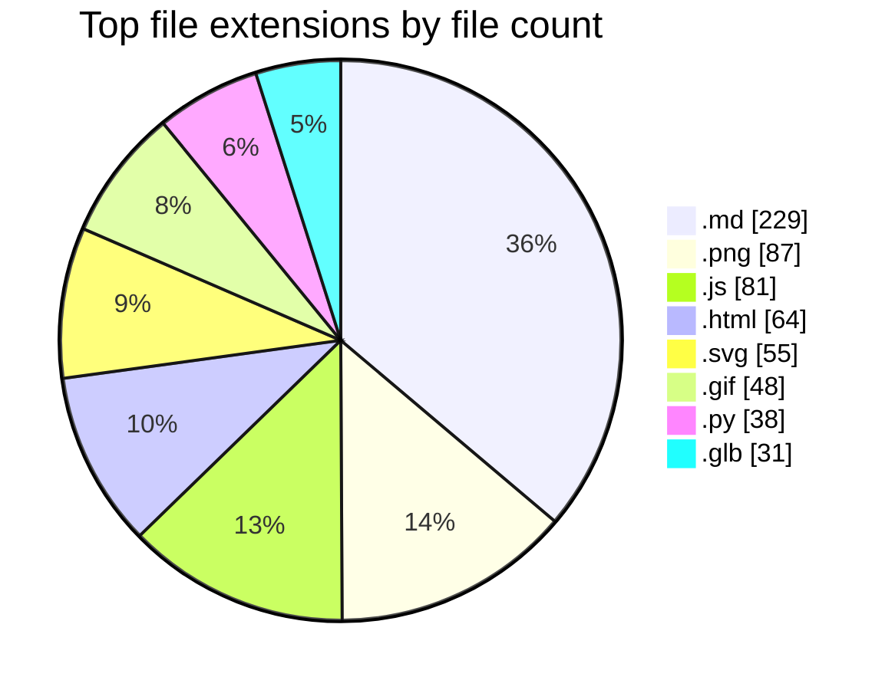

## Recent repositories

<table width="100%">
<tr><td align="center"></td></tr>
<tr><td align="center"></td></tr>
<tr><td align="center"></td></tr>
<tr><td align="center"></td></tr>
<tr><td align="center"></td></tr>
<tr><td align="center"></td></tr>
<tr><td align="center"></td></tr>
<tr><td align="center"></td></tr>
<tr><td align="center"></td></tr>
<tr><td align="center"></td></tr>
<tr><td align="center"></td></tr>
<tr><td align="center"></td></tr>
</table>

# 냥캣 (`tchinso`) GitHub Profile

> Last refreshed automatically: **2026-06-29 00:46 UTC**

## Language ratio across my repositories

```mermaid
pie showData
    title Language ratio by bytes across public repositories
    "HTML" : 1304209
    "JavaScript" : 1304172
    "Python" : 661010
    "CSS" : 221557
    "C" : 83129
    "C#" : 39853
    "PowerShell" : 18578
```

언어 비율 표 보기 (접힘)

| Language | Bytes | Ratio |
| --- | ---: | ---: |
| HTML | 1,304,209 | 35.9% |
| JavaScript | 1,304,172 | 35.9% |
| Python | 661,010 | 18.2% |
| CSS | 221,557 | 6.1% |
| C | 83,129 | 2.3% |
| C# | 39,853 | 1.1% |
| PowerShell | 18,578 | 0.5% |

## Extension ranking

```mermaid
pie showData
    title Top file extensions by file count
    ".md" : 229
    ".png" : 87
    ".js" : 81
    ".html" : 64
    ".svg" : 55
    ".gif" : 48
    ".py" : 38
    ".glb" : 31
```

확장자 랭킹 표 보기 (접힘)

| Rank | Extension | Files |
| --- | --- | ---: |
| 1 | `.md` | 229 |
| 2 | `.png` | 87 |
| 3 | `.js` | 81 |
| 4 | `.html` | 64 |
| 5 | `.svg` | 55 |
| 6 | `.gif` | 48 |
| 7 | `.py` | 38 |
| 8 | `.glb` | 31 |
| 9 | `.json` | 21 |
| 10 | `.css` | 14 |
| 11 | `.yml` | 7 |
| 12 | `.gitignore` | 7 |
| 13 | `.spec` | 7 |
| 14 | `.mp3` | 7 |
| 15 | `.ico` | 6 |
| 16 | `.mjs` | 5 |
| 17 | `.txt` | 5 |
| 18 | `.cfg` | 4 |
| 19 | `.gitkeep` | 3 |
| 20 | `.log` | 3 |
| 21 | `.onnx` | 3 |
| 22 | `.webp` | 2 |
| 23 | `.jpg` | 2 |
| 24 | `.ps1` | 2 |
| 25 | `.pyc` | 2 |

## Live cards

