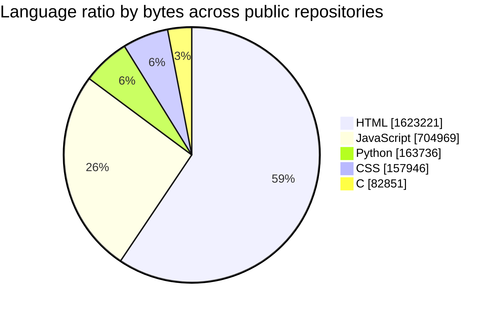
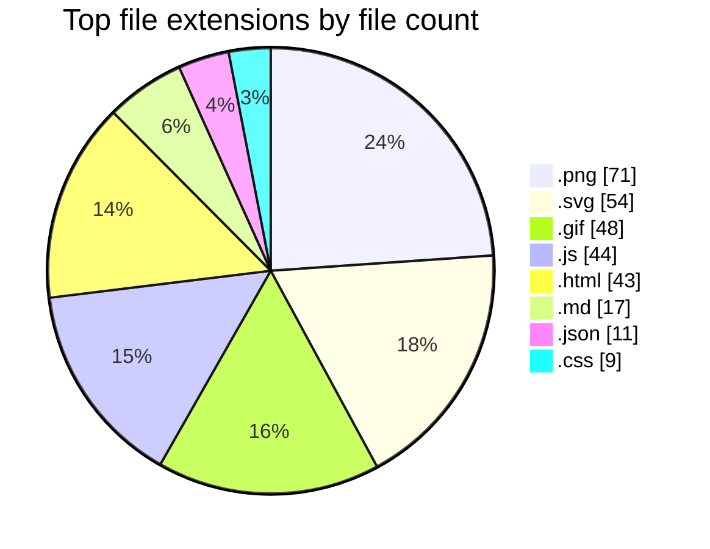

# 냥캣 (`tchinso`) GitHub Profile

> Last refreshed automatically: **2026-06-04 05:03 UTC**

## Recent repositories

<table width="100%">
<tr><td align="center"></td></tr>
<tr><td align="center"></td></tr>
<tr><td align="center"></td></tr>
<tr><td align="center"></td></tr>
<tr><td align="center"></td></tr>
<tr><td align="center"></td></tr>
<tr><td align="center"></td></tr>
<tr><td align="center"></td></tr>
<tr><td align="center"></td></tr>
</table>

## Language ratio across my repositories

```mermaid
pie showData
    title Language ratio by bytes across public repositories
    "HTML" : 1623221
    "JavaScript" : 704969
    "Python" : 163736
    "CSS" : 157946
    "C" : 82851
```

언어 비율 표 보기 (접힘)

| Language | Bytes | Ratio |
| --- | ---: | ---: |
| HTML | 1,623,221 | 59.3% |
| JavaScript | 704,969 | 25.8% |
| Python | 163,736 | 6.0% |
| CSS | 157,946 | 5.8% |
| C | 82,851 | 3.0% |

## Extension ranking

```mermaid
pie showData
    title Top file extensions by file count
    ".png" : 71
    ".svg" : 54
    ".gif" : 48
    ".js" : 44
    ".html" : 43
    ".md" : 17
    ".json" : 11
    ".css" : 9
```

확장자 랭킹 표 보기 (접힘)

| Rank | Extension | Files |
| --- | --- | ---: |
| 1 | `.png` | 71 |
| 2 | `.svg` | 54 |
| 3 | `.gif` | 48 |
| 4 | `.js` | 44 |
| 5 | `.html` | 43 |
| 6 | `.md` | 17 |
| 7 | `.json` | 11 |
| 8 | `.css` | 9 |
| 9 | `.py` | 7 |
| 10 | `.pyc` | 6 |
| 11 | `.onnx` | 3 |
| 12 | `.spec` | 2 |
| 13 | `.ps1` | 2 |
| 14 | `.txt` | 2 |
| 15 | `.c` | 2 |
| 16 | `.bat` | 2 |
| 17 | `.ico` | 1 |
| 18 | `.webp` | 1 |
| 19 | `.jpeg` | 1 |
| 20 | `.mp3` | 1 |

## Live cards

