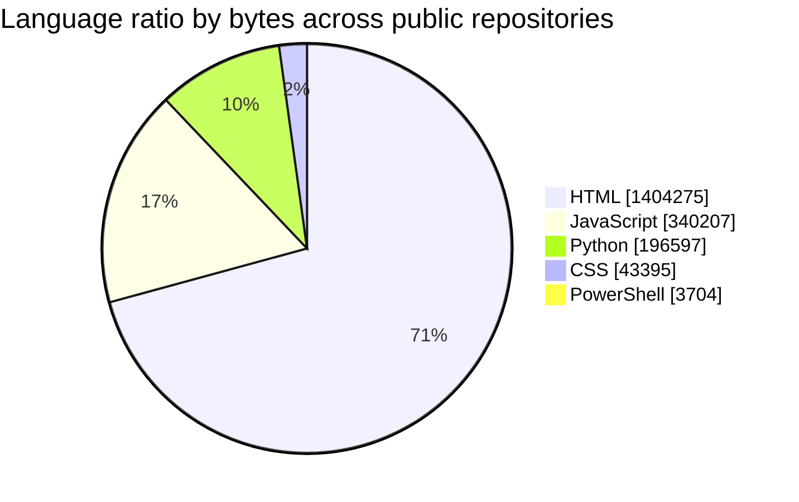
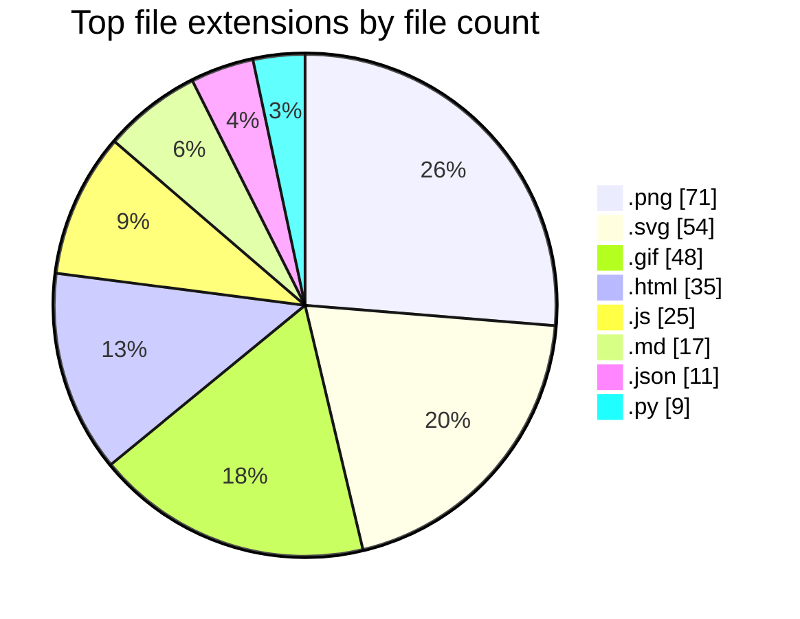

# 냥캣 (`tchinso`) GitHub Profile

> Last refreshed automatically: **2026-05-28 04:37 UTC**

## Recent repositories

<table width="100%">
<tr><td align="center"></td></tr>
<tr><td align="center"></td></tr>
<tr><td align="center"></td></tr>
<tr><td align="center"></td></tr>
<tr><td align="center"></td></tr>
<tr><td align="center"></td></tr>
<tr><td align="center"></td></tr>
<tr><td align="center"></td></tr>
<tr><td align="center"></td></tr>
</table>

## Language ratio across my repositories

```mermaid
pie showData
    title Language ratio by bytes across public repositories
    "HTML" : 1404275
    "JavaScript" : 340207
    "Python" : 196597
    "CSS" : 43395
    "PowerShell" : 3704
```

언어 비율 표 보기 (접힘)

| Language | Bytes | Ratio |
| --- | ---: | ---: |
| HTML | 1,404,275 | 70.6% |
| JavaScript | 340,207 | 17.1% |
| Python | 196,597 | 9.9% |
| CSS | 43,395 | 2.2% |
| PowerShell | 3,704 | 0.2% |

## Extension ranking

```mermaid
pie showData
    title Top file extensions by file count
    ".png" : 71
    ".svg" : 54
    ".gif" : 48
    ".html" : 35
    ".js" : 25
    ".md" : 17
    ".json" : 11
    ".py" : 9
```

확장자 랭킹 표 보기 (접힘)

| Rank | Extension | Files |
| --- | --- | ---: |
| 1 | `.png` | 71 |
| 2 | `.svg` | 54 |
| 3 | `.gif` | 48 |
| 4 | `.html` | 35 |
| 5 | `.js` | 25 |
| 6 | `.md` | 17 |
| 7 | `.json` | 11 |
| 8 | `.py` | 9 |
| 9 | `.css` | 8 |
| 10 | `.pyc` | 6 |
| 11 | `.onnx` | 3 |
| 12 | `.spec` | 2 |
| 13 | `.ps1` | 2 |
| 14 | `.txt` | 2 |
| 15 | `.bat` | 2 |
| 16 | `.ico` | 1 |
| 17 | `.webp` | 1 |
| 18 | `.jpg` | 1 |
| 19 | `.yml` | 1 |
| 20 | `.gitignore` | 1 |

## Live cards

