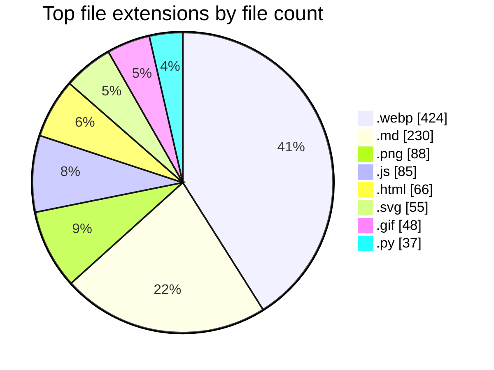

## Recent repositories

<table width="100%">
<tr><td align="center"></td></tr>
<tr><td align="center"></td></tr>
<tr><td align="center"></td></tr>
<tr><td align="center"></td></tr>
<tr><td align="center"></td></tr>
<tr><td align="center"></td></tr>
<tr><td align="center"></td></tr>
<tr><td align="center"></td></tr>
<tr><td align="center"></td></tr>
<tr><td align="center"></td></tr>
<tr><td align="center"></td></tr>
<tr><td align="center"></td></tr>
</table>

# 냥캣 (`tchinso`) GitHub Profile

> Last refreshed automatically: **2026-07-06 08:14 UTC**

## Language ratio across my repositories

```mermaid
pie showData
    title Language ratio by bytes across public repositories
    "JavaScript" : 1358437
    "HTML" : 1307769
    "Python" : 658732
    "CSS" : 238907
    "C#" : 96513
    "C" : 33939
    "PowerShell" : 21187
```

언어 비율 표 보기 (접힘)

| Language | Bytes | Ratio |
| --- | ---: | ---: |
| JavaScript | 1,358,437 | 36.6% |
| HTML | 1,307,769 | 35.2% |
| Python | 658,732 | 17.7% |
| CSS | 238,907 | 6.4% |
| C# | 96,513 | 2.6% |
| C | 33,939 | 0.9% |
| PowerShell | 21,187 | 0.6% |

## Extension ranking

```mermaid
pie showData
    title Top file extensions by file count
    ".webp" : 424
    ".md" : 230
    ".png" : 88
    ".js" : 85
    ".html" : 66
    ".svg" : 55
    ".gif" : 48
    ".py" : 37
```

확장자 랭킹 표 보기 (접힘)

| Rank | Extension | Files |
| --- | --- | ---: |
| 1 | `.webp` | 424 |
| 2 | `.md` | 230 |
| 3 | `.png` | 88 |
| 4 | `.js` | 85 |
| 5 | `.html` | 66 |
| 6 | `.svg` | 55 |
| 7 | `.gif` | 48 |
| 8 | `.py` | 37 |
| 9 | `.glb` | 31 |
| 10 | `.json` | 23 |
| 11 | `.css` | 16 |
| 12 | `.gitignore` | 9 |
| 13 | `.txt` | 7 |
| 14 | `.yml` | 7 |
| 15 | `.spec` | 7 |
| 16 | `.mp3` | 7 |
| 17 | `.ico` | 6 |
| 18 | `.mjs` | 5 |
| 19 | `.cfg` | 4 |
| 20 | `.ps1` | 3 |
| 21 | `.gitattributes` | 3 |
| 22 | `.gitkeep` | 3 |
| 23 | `.log` | 3 |
| 24 | `.onnx` | 3 |
| 25 | `.cs` | 2 |

## Live cards

