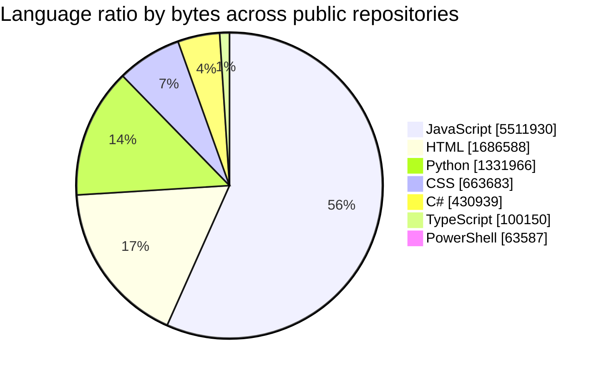
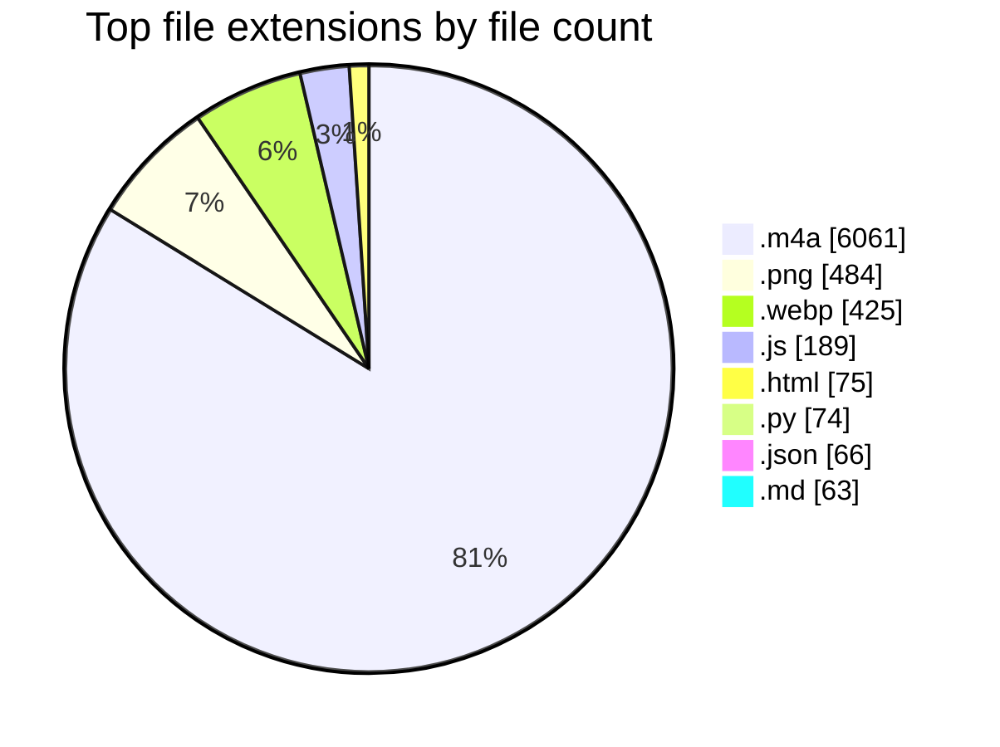

## Recent repositories

<table width="100%">
<tr><td align="center"></td></tr>
<tr><td align="center"></td></tr>
<tr><td align="center"></td></tr>
<tr><td align="center"></td></tr>
<tr><td align="center"></td></tr>
<tr><td align="center"></td></tr>
<tr><td align="center"></td></tr>
<tr><td align="center"></td></tr>
<tr><td align="center"></td></tr>
<tr><td align="center"></td></tr>
<tr><td align="center"></td></tr>
<tr><td align="center"></td></tr>
</table>

# 냥캣 (`tchinso`) GitHub Profile

> Last refreshed automatically: **2026-09-20 22:25 UTC**

## Language ratio across my repositories

```mermaid
pie showData
    title Language ratio by bytes across public repositories
    "JavaScript" : 5511930
    "HTML" : 1686588
    "Python" : 1331966
    "CSS" : 663683
    "C#" : 430939
    "TypeScript" : 100150
    "PowerShell" : 63587
```

언어 비율 표 보기 (접힘)

| Language | Bytes | Ratio |
| --- | ---: | ---: |
| JavaScript | 5,511,930 | 55.7% |
| HTML | 1,686,588 | 17.1% |
| Python | 1,331,966 | 13.5% |
| CSS | 663,683 | 6.7% |
| C# | 430,939 | 4.4% |
| TypeScript | 100,150 | 1.0% |
| PowerShell | 63,587 | 0.6% |

## Extension ranking

```mermaid
pie showData
    title Top file extensions by file count
    ".m4a" : 6061
    ".png" : 484
    ".webp" : 425
    ".js" : 189
    ".html" : 75
    ".py" : 74
    ".json" : 66
    ".md" : 63
```

확장자 랭킹 표 보기 (접힘)

| Rank | Extension | Files |
| --- | --- | ---: |
| 1 | `.m4a` | 6,061 |
| 2 | `.png` | 484 |
| 3 | `.webp` | 425 |
| 4 | `.js` | 189 |
| 5 | `.html` | 75 |
| 6 | `.py` | 74 |
| 7 | `.json` | 66 |
| 8 | `.md` | 63 |
| 9 | `.svg` | 63 |
| 10 | `.gif` | 48 |
| 11 | `.sql` | 44 |
| 12 | `.glb` | 32 |
| 13 | `.css` | 26 |
| 14 | `.cs` | 26 |
| 15 | `.gitignore` | 22 |
| 16 | `.txt` | 21 |
| 17 | `.mjs` | 21 |
| 18 | `.yml` | 14 |
| 19 | `.gitattributes` | 8 |
| 20 | `.spec` | 8 |
| 21 | `.ico` | 8 |
| 22 | `.mp3` | 7 |
| 23 | `.ps1` | 6 |
| 24 | `.wasm` | 5 |
| 25 | `.cfg` | 4 |

## GitHub Profile Summary

  

  
  

  
  

