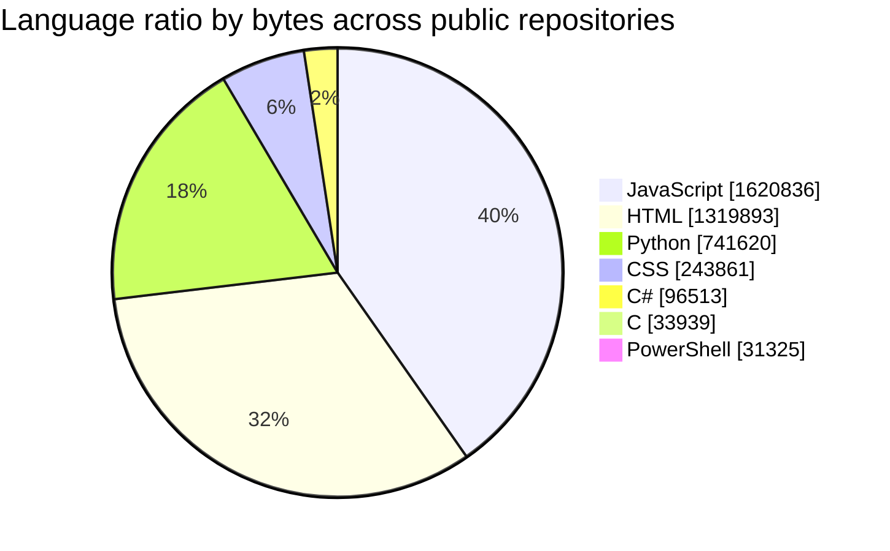
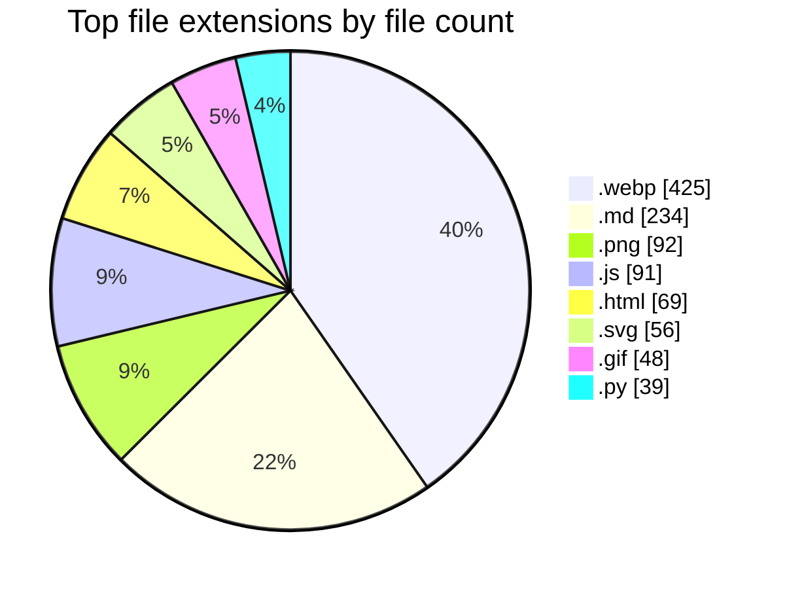

## Recent repositories

<table width="100%">
<tr><td align="center"></td></tr>
<tr><td align="center"></td></tr>
<tr><td align="center"></td></tr>
<tr><td align="center"></td></tr>
<tr><td align="center"></td></tr>
<tr><td align="center"></td></tr>
<tr><td align="center"></td></tr>
<tr><td align="center"></td></tr>
<tr><td align="center"></td></tr>
<tr><td align="center"></td></tr>
<tr><td align="center"></td></tr>
<tr><td align="center"></td></tr>
</table>

# 냥캣 (`tchinso`) GitHub Profile

> Last refreshed automatically: **2026-07-12 00:30 UTC**

## Language ratio across my repositories

```mermaid
pie showData
    title Language ratio by bytes across public repositories
    "JavaScript" : 1620836
    "HTML" : 1319893
    "Python" : 741620
    "CSS" : 243861
    "C#" : 96513
    "C" : 33939
    "PowerShell" : 31325
```

언어 비율 표 보기 (접힘)

| Language | Bytes | Ratio |
| --- | ---: | ---: |
| JavaScript | 1,620,836 | 39.6% |
| HTML | 1,319,893 | 32.3% |
| Python | 741,620 | 18.1% |
| CSS | 243,861 | 6.0% |
| C# | 96,513 | 2.4% |
| C | 33,939 | 0.8% |
| PowerShell | 31,325 | 0.8% |

## Extension ranking

```mermaid
pie showData
    title Top file extensions by file count
    ".webp" : 425
    ".md" : 234
    ".png" : 92
    ".js" : 91
    ".html" : 69
    ".svg" : 56
    ".gif" : 48
    ".py" : 39
```

확장자 랭킹 표 보기 (접힘)

| Rank | Extension | Files |
| --- | --- | ---: |
| 1 | `.webp` | 425 |
| 2 | `.md` | 234 |
| 3 | `.png` | 92 |
| 4 | `.js` | 91 |
| 5 | `.html` | 69 |
| 6 | `.svg` | 56 |
| 7 | `.gif` | 48 |
| 8 | `.py` | 39 |
| 9 | `.glb` | 31 |
| 10 | `.json` | 24 |
| 11 | `.css` | 18 |
| 12 | `.gitignore` | 10 |
| 13 | `.txt` | 8 |
| 14 | `.yml` | 7 |
| 15 | `.spec` | 7 |
| 16 | `.mp3` | 7 |
| 17 | `.ico` | 6 |
| 18 | `.mjs` | 5 |
| 19 | `.gitattributes` | 4 |
| 20 | `.ps1` | 4 |
| 21 | `.cfg` | 4 |
| 22 | `.gitkeep` | 3 |
| 23 | `.onnx` | 3 |
| 24 | `.bat` | 2 |
| 25 | `.jpeg` | 2 |

## Live cards

