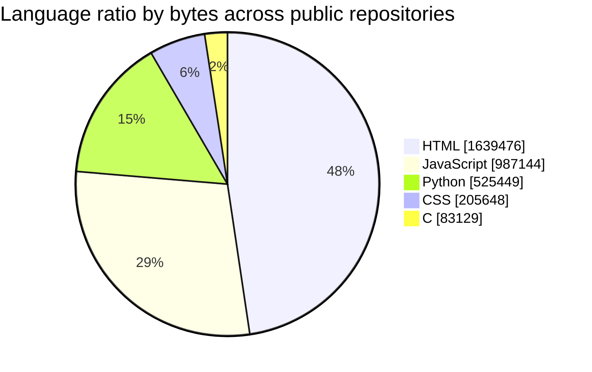
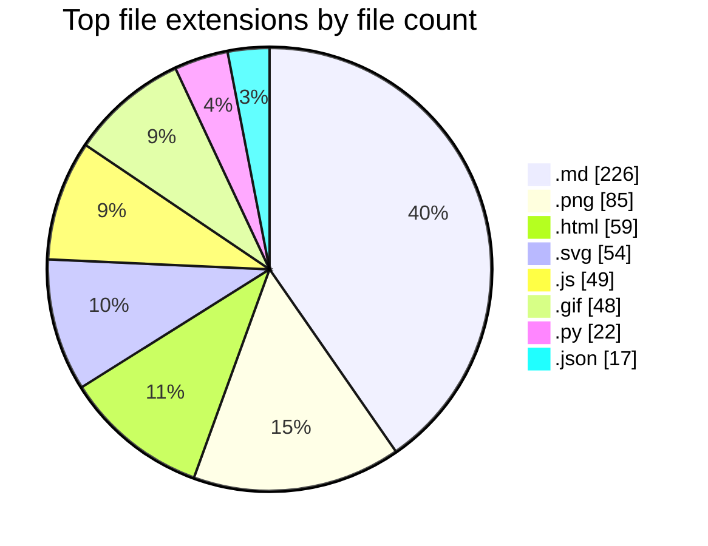

## Recent repositories

<table width="100%">
<tr><td align="center"></td></tr>
<tr><td align="center"></td></tr>
<tr><td align="center"></td></tr>
<tr><td align="center"></td></tr>
<tr><td align="center"></td></tr>
<tr><td align="center"></td></tr>
<tr><td align="center"></td></tr>
<tr><td align="center"></td></tr>
<tr><td align="center"></td></tr>
<tr><td align="center"></td></tr>
<tr><td align="center"></td></tr>
<tr><td align="center"></td></tr>
</table>

# 냥캣 (`tchinso`) GitHub Profile

> Last refreshed automatically: **2026-06-20 16:57 UTC**

## Language ratio across my repositories

```mermaid
pie showData
    title Language ratio by bytes across public repositories
    "HTML" : 1639476
    "JavaScript" : 987144
    "Python" : 525449
    "CSS" : 205648
    "C" : 83129
```

언어 비율 표 보기 (접힘)

| Language | Bytes | Ratio |
| --- | ---: | ---: |
| HTML | 1,639,476 | 47.5% |
| JavaScript | 987,144 | 28.6% |
| Python | 525,449 | 15.2% |
| CSS | 205,648 | 6.0% |
| C | 83,129 | 2.4% |

## Extension ranking

```mermaid
pie showData
    title Top file extensions by file count
    ".md" : 226
    ".png" : 85
    ".html" : 59
    ".svg" : 54
    ".js" : 49
    ".gif" : 48
    ".py" : 22
    ".json" : 17
```

확장자 랭킹 표 보기 (접힘)

| Rank | Extension | Files |
| --- | --- | ---: |
| 1 | `.md` | 226 |
| 2 | `.png` | 85 |
| 3 | `.html` | 59 |
| 4 | `.svg` | 54 |
| 5 | `.js` | 49 |
| 6 | `.gif` | 48 |
| 7 | `.py` | 22 |
| 8 | `.json` | 17 |
| 9 | `.css` | 11 |
| 10 | `.mp3` | 7 |
| 11 | `.ico` | 6 |
| 12 | `.yml` | 6 |
| 13 | `.gitignore` | 5 |
| 14 | `.spec` | 5 |
| 15 | `.glb` | 4 |
| 16 | `.gitkeep` | 3 |
| 17 | `.log` | 3 |
| 18 | `.txt` | 3 |
| 19 | `.onnx` | 3 |
| 20 | `.ps1` | 2 |

## Live cards

