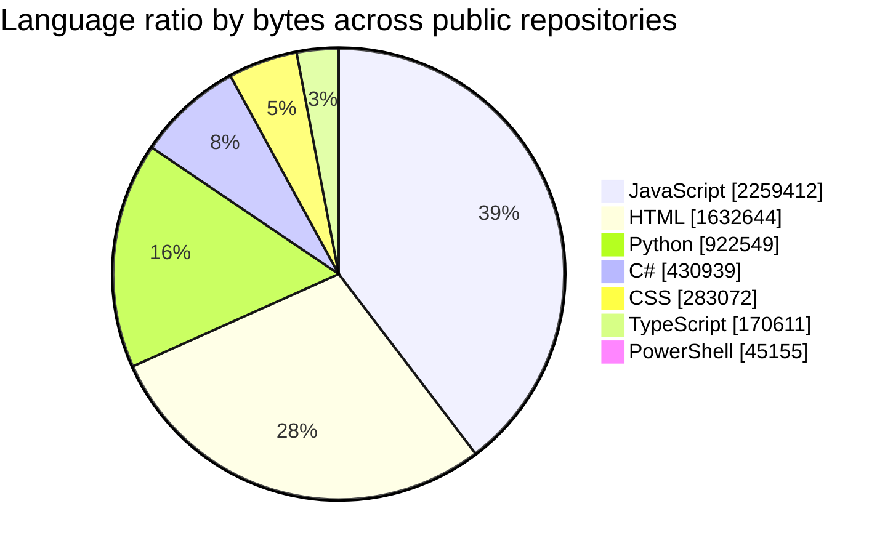
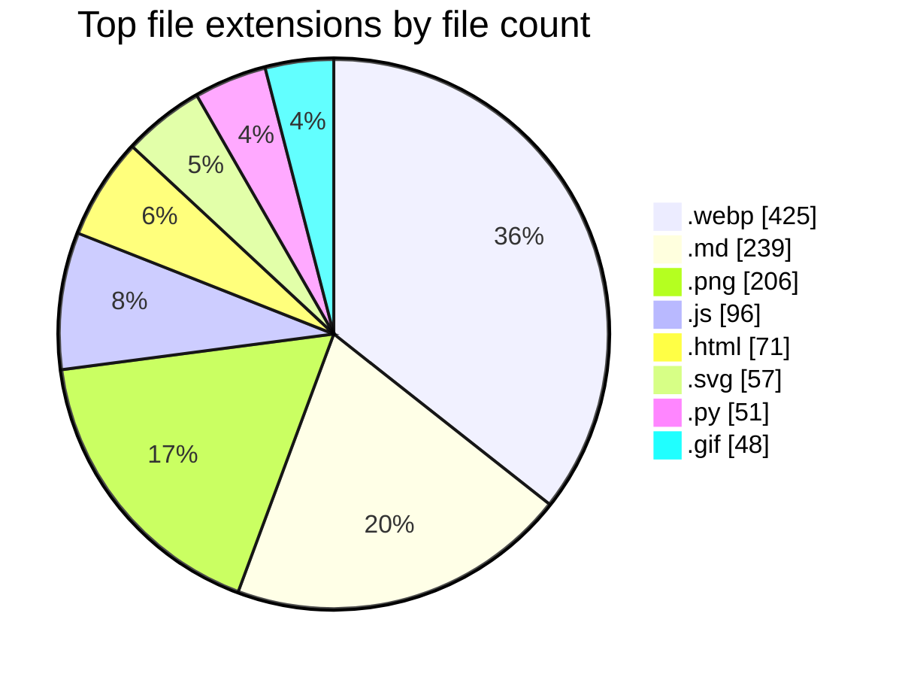

## Recent repositories

<table width="100%">
<tr><td align="center"></td></tr>
<tr><td align="center"></td></tr>
<tr><td align="center"></td></tr>
<tr><td align="center"></td></tr>
<tr><td align="center"></td></tr>
<tr><td align="center"></td></tr>
<tr><td align="center"></td></tr>
<tr><td align="center"></td></tr>
<tr><td align="center"></td></tr>
<tr><td align="center"></td></tr>
<tr><td align="center"></td></tr>
<tr><td align="center"></td></tr>
</table>

# 냥캣 (`tchinso`) GitHub Profile

> Last refreshed automatically: **2026-08-16 20:36 UTC**

## Language ratio across my repositories

```mermaid
pie showData
    title Language ratio by bytes across public repositories
    "JavaScript" : 2259412
    "HTML" : 1632644
    "Python" : 922549
    "C#" : 430939
    "CSS" : 283072
    "TypeScript" : 170611
    "PowerShell" : 45155
```

언어 비율 표 보기 (접힘)

| Language | Bytes | Ratio |
| --- | ---: | ---: |
| JavaScript | 2,259,412 | 39.1% |
| HTML | 1,632,644 | 28.2% |
| Python | 922,549 | 16.0% |
| C# | 430,939 | 7.5% |
| CSS | 283,072 | 4.9% |
| TypeScript | 170,611 | 3.0% |
| PowerShell | 45,155 | 0.8% |

## Extension ranking

```mermaid
pie showData
    title Top file extensions by file count
    ".webp" : 425
    ".md" : 239
    ".png" : 206
    ".js" : 96
    ".html" : 71
    ".svg" : 57
    ".py" : 51
    ".gif" : 48
```

확장자 랭킹 표 보기 (접힘)

| Rank | Extension | Files |
| --- | --- | ---: |
| 1 | `.webp` | 425 |
| 2 | `.md` | 239 |
| 3 | `.png` | 206 |
| 4 | `.js` | 96 |
| 5 | `.html` | 71 |
| 6 | `.svg` | 57 |
| 7 | `.py` | 51 |
| 8 | `.gif` | 48 |
| 9 | `.glb` | 31 |
| 10 | `.json` | 28 |
| 11 | `.cs` | 26 |
| 12 | `.css` | 20 |
| 13 | `.txt` | 16 |
| 14 | `.gitignore` | 15 |
| 15 | `.mjs` | 14 |
| 16 | `.spec` | 8 |
| 17 | `.ts` | 8 |
| 18 | `.jpg` | 8 |
| 19 | `.gitattributes` | 7 |
| 20 | `.yml` | 7 |
| 21 | `.ico` | 7 |
| 22 | `.mp3` | 7 |
| 23 | `.ps1` | 6 |
| 24 | `.wasm` | 4 |
| 25 | `.cfg` | 4 |

## GitHub Profile Summary

  

  
  

  
  

