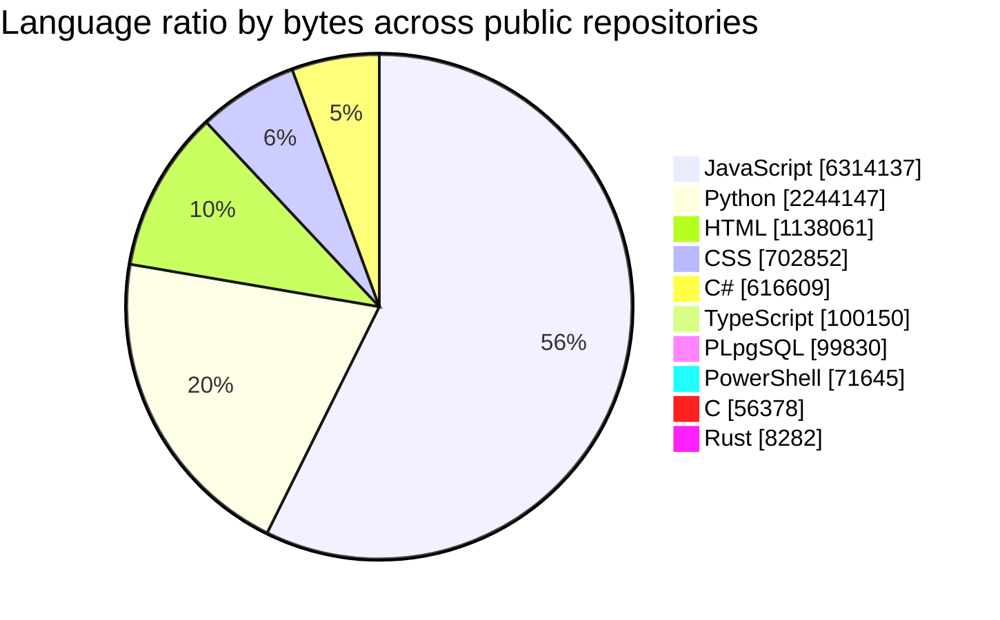
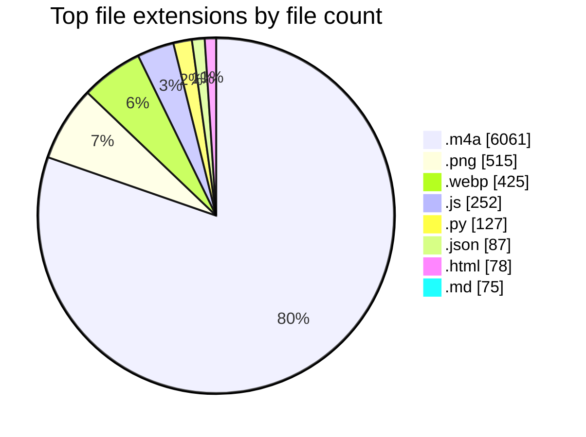

## Recent repositories

<table width="100%">
<tr><td align="center"></td></tr>
<tr><td align="center"></td></tr>
<tr><td align="center"></td></tr>
<tr><td align="center"></td></tr>
<tr><td align="center"></td></tr>
<tr><td align="center"></td></tr>
<tr><td align="center"></td></tr>
<tr><td align="center"></td></tr>
<tr><td align="center"></td></tr>
<tr><td align="center"></td></tr>
<tr><td align="center"></td></tr>
<tr><td align="center"></td></tr>
<tr><td align="center"></td></tr>
<tr><td align="center"></td></tr>
<tr><td align="center"></td></tr>
</table>

# 냥캣 (`tchinso`) GitHub Profile

> Last refreshed automatically: **2026-10-09 00:21 UTC**

## Language ratio across my repositories

```mermaid
pie showData
    title Language ratio by bytes across public repositories
    "JavaScript" : 6314137
    "Python" : 2244147
    "HTML" : 1138061
    "CSS" : 702852
    "C#" : 616609
    "TypeScript" : 100150
    "PLpgSQL" : 99830
    "PowerShell" : 71645
    "C" : 56378
    "Rust" : 8282
```

언어 비율 표 보기 (접힘)

| Language | Bytes | Ratio |
| --- | ---: | ---: |
| JavaScript | 6,314,137 | 55.6% |
| Python | 2,244,147 | 19.8% |
| HTML | 1,138,061 | 10.0% |
| CSS | 702,852 | 6.2% |
| C# | 616,609 | 5.4% |
| TypeScript | 100,150 | 0.9% |
| PLpgSQL | 99,830 | 0.9% |
| PowerShell | 71,645 | 0.6% |
| C | 56,378 | 0.5% |
| Rust | 8,282 | 0.1% |

## Extension ranking

```mermaid
pie showData
    title Top file extensions by file count
    ".m4a" : 6061
    ".png" : 515
    ".webp" : 425
    ".js" : 252
    ".py" : 127
    ".json" : 87
    ".html" : 78
    ".md" : 75
```

확장자 랭킹 표 보기 (접힘)

| Rank | Extension | Files |
| --- | --- | ---: |
| 1 | `.m4a` | 6,061 |
| 2 | `.png` | 515 |
| 3 | `.webp` | 425 |
| 4 | `.js` | 252 |
| 5 | `.py` | 127 |
| 6 | `.json` | 87 |
| 7 | `.html` | 78 |
| 8 | `.md` | 75 |
| 9 | `.svg` | 63 |
| 10 | `.gif` | 51 |
| 11 | `.sql` | 47 |
| 12 | `.glb` | 46 |
| 13 | `.cs` | 38 |
| 14 | `.txt` | 30 |
| 15 | `.css` | 30 |
| 16 | `.gitignore` | 27 |
| 17 | `.mjs` | 25 |
| 18 | `.yml` | 15 |
| 19 | `.gitattributes` | 9 |
| 20 | `.spec` | 9 |
| 21 | `.ps1` | 8 |
| 22 | `.ico` | 8 |
| 23 | `.mp3` | 7 |
| 24 | `.woff2` | 6 |
| 25 | `.csproj` | 5 |
| 26 | `.wasm` | 5 |
| 27 | `.cfg` | 4 |
| 28 | `.bat` | 4 |
| 29 | `.ttf` | 4 |
| 30 | `.exe` | 4 |

## GitHub Profile Summary

  

  
  

  
  

