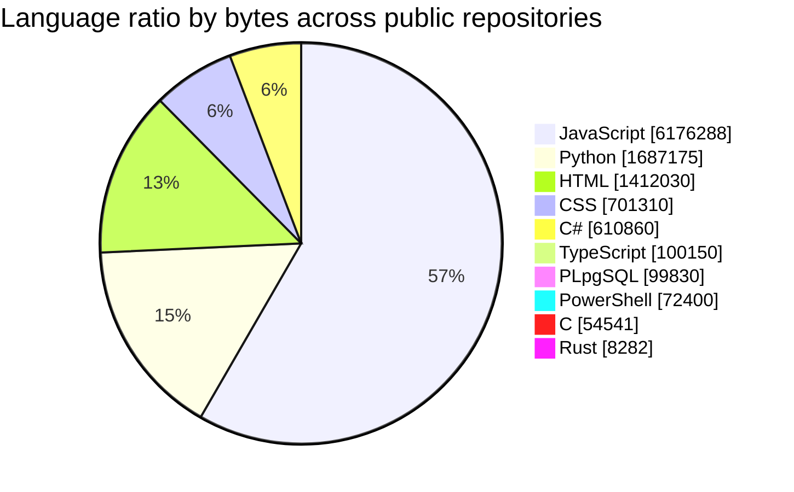
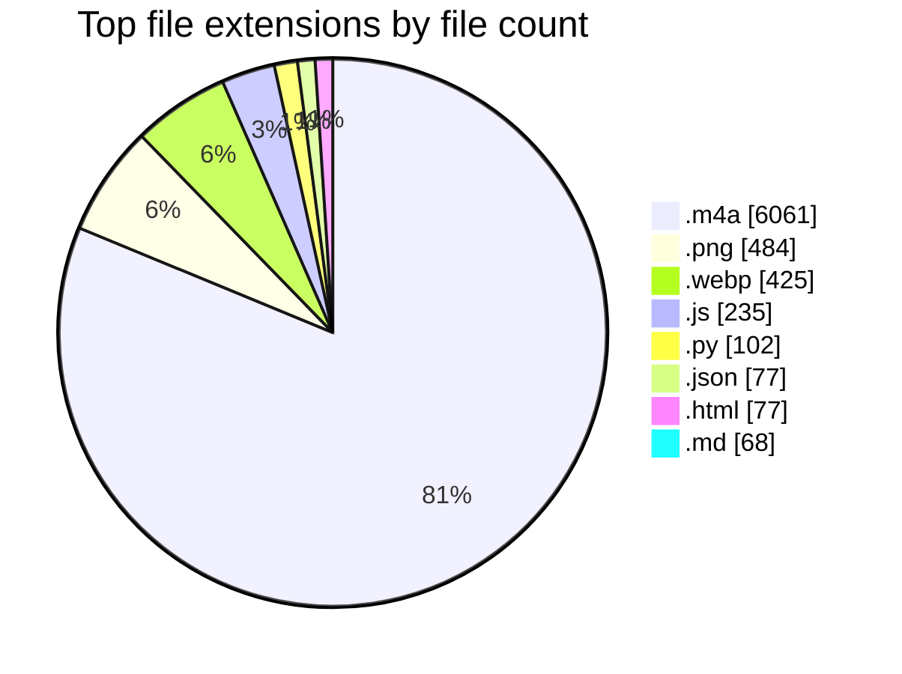

## Recent repositories

<table width="100%">
<tr><td align="center"></td></tr>
<tr><td align="center"></td></tr>
<tr><td align="center"></td></tr>
<tr><td align="center"></td></tr>
<tr><td align="center"></td></tr>
<tr><td align="center"></td></tr>
<tr><td align="center"></td></tr>
<tr><td align="center"></td></tr>
<tr><td align="center"></td></tr>
<tr><td align="center"></td></tr>
<tr><td align="center"></td></tr>
<tr><td align="center"></td></tr>
<tr><td align="center"></td></tr>
<tr><td align="center"></td></tr>
<tr><td align="center"></td></tr>
</table>

# 냥캣 (`tchinso`) GitHub Profile

> Last refreshed automatically: **2026-10-04 23:07 UTC**

## Language ratio across my repositories

```mermaid
pie showData
    title Language ratio by bytes across public repositories
    "JavaScript" : 6176288
    "Python" : 1687175
    "HTML" : 1412030
    "CSS" : 701310
    "C#" : 610860
    "TypeScript" : 100150
    "PLpgSQL" : 99830
    "PowerShell" : 72400
    "C" : 54541
    "Rust" : 8282
```

언어 비율 표 보기 (접힘)

| Language | Bytes | Ratio |
| --- | ---: | ---: |
| JavaScript | 6,176,288 | 56.5% |
| Python | 1,687,175 | 15.4% |
| HTML | 1,412,030 | 12.9% |
| CSS | 701,310 | 6.4% |
| C# | 610,860 | 5.6% |
| TypeScript | 100,150 | 0.9% |
| PLpgSQL | 99,830 | 0.9% |
| PowerShell | 72,400 | 0.7% |
| C | 54,541 | 0.5% |
| Rust | 8,282 | 0.1% |

## Extension ranking

```mermaid
pie showData
    title Top file extensions by file count
    ".m4a" : 6061
    ".png" : 484
    ".webp" : 425
    ".js" : 235
    ".py" : 102
    ".json" : 77
    ".html" : 77
    ".md" : 68
```

확장자 랭킹 표 보기 (접힘)

| Rank | Extension | Files |
| --- | --- | ---: |
| 1 | `.m4a` | 6,061 |
| 2 | `.png` | 484 |
| 3 | `.webp` | 425 |
| 4 | `.js` | 235 |
| 5 | `.py` | 102 |
| 6 | `.json` | 77 |
| 7 | `.html` | 77 |
| 8 | `.md` | 68 |
| 9 | `.svg` | 63 |
| 10 | `.gif` | 48 |
| 11 | `.sql` | 47 |
| 12 | `.cs` | 38 |
| 13 | `.glb` | 32 |
| 14 | `.css` | 29 |
| 15 | `.gitignore` | 25 |
| 16 | `.mjs` | 24 |
| 17 | `.txt` | 21 |
| 18 | `.yml` | 14 |
| 19 | `.spec` | 9 |
| 20 | `.ico` | 8 |
| 21 | `.gitattributes` | 8 |
| 22 | `.ps1` | 8 |
| 23 | `.mp3` | 7 |
| 24 | `.wasm` | 5 |
| 25 | `.csproj` | 5 |
| 26 | `.bat` | 4 |
| 27 | `.cfg` | 4 |
| 28 | `.exe` | 4 |
| 29 | `.yaml` | 4 |
| 30 | `.jpg` | 3 |

## GitHub Profile Summary

  

  
  

  
  

