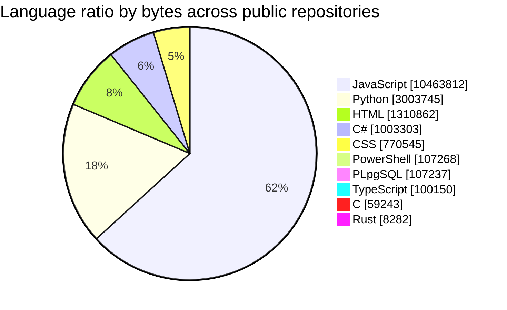
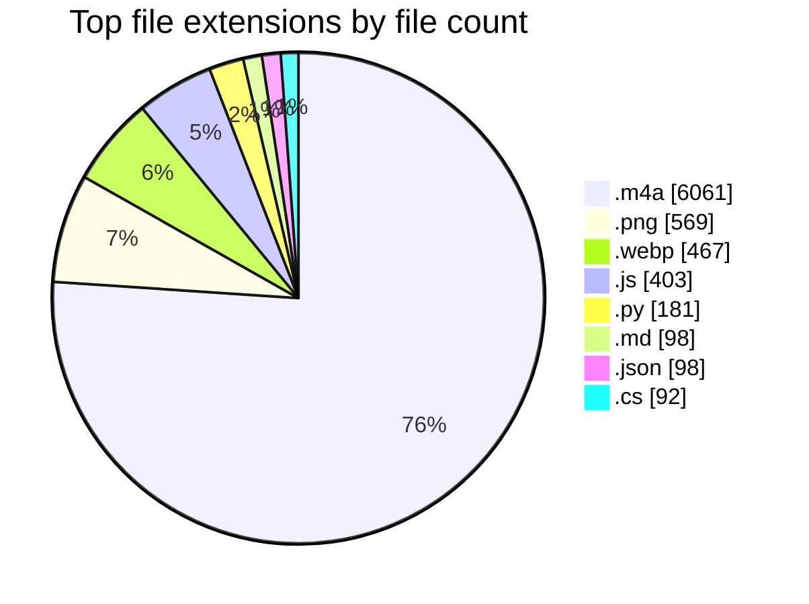

## Recent repositories

<table width="100%">
<tr><td align="center"></td></tr>
<tr><td align="center"></td></tr>
<tr><td align="center"></td></tr>
<tr><td align="center"></td></tr>
<tr><td align="center"></td></tr>
<tr><td align="center"></td></tr>
<tr><td align="center"></td></tr>
<tr><td align="center"></td></tr>
<tr><td align="center"></td></tr>
<tr><td align="center"></td></tr>
<tr><td align="center"></td></tr>
<tr><td align="center"></td></tr>
<tr><td align="center"></td></tr>
<tr><td align="center"></td></tr>
<tr><td align="center"></td></tr>
</table>

# 냥캣 (`tchinso`) GitHub Profile

> Last refreshed automatically: **2026-11-11 00:39 UTC**

## Language ratio across my repositories

```mermaid
pie showData
    title Language ratio by bytes across public repositories
    "JavaScript" : 10463812
    "Python" : 3003745
    "HTML" : 1310862
    "C#" : 1003303
    "CSS" : 770545
    "PowerShell" : 107268
    "PLpgSQL" : 107237
    "TypeScript" : 100150
    "C" : 59243
    "Rust" : 8282
```

언어 비율 표 보기 (접힘)

| Language | Bytes | Ratio |
| --- | ---: | ---: |
| JavaScript | 10,463,812 | 61.8% |
| Python | 3,003,745 | 17.7% |
| HTML | 1,310,862 | 7.7% |
| C# | 1,003,303 | 5.9% |
| CSS | 770,545 | 4.5% |
| PowerShell | 107,268 | 0.6% |
| PLpgSQL | 107,237 | 0.6% |
| TypeScript | 100,150 | 0.6% |
| C | 59,243 | 0.3% |
| Rust | 8,282 | 0.0% |

## Extension ranking

```mermaid
pie showData
    title Top file extensions by file count
    ".m4a" : 6061
    ".png" : 569
    ".webp" : 467
    ".js" : 403
    ".py" : 181
    ".md" : 98
    ".json" : 98
    ".cs" : 92
```

확장자 랭킹 표 보기 (접힘)

| Rank | Extension | Files |
| --- | --- | ---: |
| 1 | `.m4a` | 6,061 |
| 2 | `.png` | 569 |
| 3 | `.webp` | 467 |
| 4 | `.js` | 403 |
| 5 | `.py` | 181 |
| 6 | `.md` | 98 |
| 7 | `.json` | 98 |
| 8 | `.cs` | 92 |
| 9 | `.html` | 89 |
| 10 | `.svg` | 62 |
| 11 | `.gif` | 52 |
| 12 | `.sql` | 49 |
| 13 | `.mjs` | 46 |
| 14 | `.css` | 44 |
| 15 | `.gitignore` | 28 |
| 16 | `.txt` | 28 |
| 17 | `.glb` | 20 |
| 18 | `.jpg` | 17 |
| 19 | `.ps1` | 14 |
| 20 | `.cjs` | 14 |
| 21 | `.gitattributes` | 13 |
| 22 | `.yml` | 13 |
| 23 | `.csproj` | 12 |
| 24 | `.ico` | 10 |
| 25 | `.spec` | 8 |
| 26 | `.xaml` | 7 |
| 27 | `.mp3` | 7 |
| 28 | `.wasm` | 6 |
| 29 | `.woff2` | 6 |
| 30 | `.yaml` | 5 |

## GitHub Profile Summary

  

  
  

  
  

